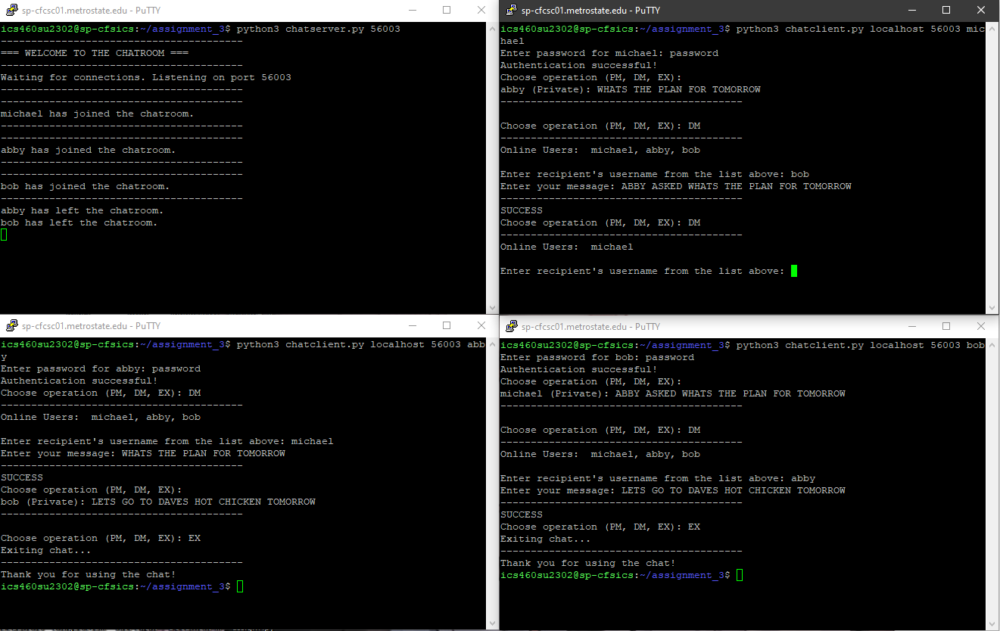

# Threaded-Chat-Server-Python



A multi-client chatroom application built in Python, supporting both public broadcasts and direct messages. Features threaded server-client communication and simple file-based user authentication for demonstration purposes.

This directory contains the source files and additional resources for the Chat Application. The application is a basic chat system that allows users to communicate in real-time. Users can send both public and private messages, and a simple authentication mechanism has been added for registered users.

### Files Included:
- `chatclient.py` - The client-side script for users to connect to the chat server.
- `chatserver.py` - The server-side script responsible for managing connected clients, messages, and user authentication.
- `users.txt` - A simple text database that holds registered users' usernames and their respective passwords.

## Features
- Public Chat: Users can participate in a public chat room.
- Direct Messaging: Users can send private messages to each other.
- User Authentication: A basic file-based authentication system is in place for demonstration purposes.

### Compilation and Running Instructions:
This application is developed in Python and does not require any compilation. To run the server or client, you just need a Python interpreter.

**To run the server:**
```bash
$ python3 chatserver.py <Port>
```
Replace `<Port>` with the port number you want the server to listen on (e.g., `5000`).

**To run the client:**
```bash
$ python3 chatclient.py <Server_Name> <Port> <Username>
```
Replace `<Server_Name>` with the hostname or IP address of the server, `<Port>` with the port number the server is listening on, and `<Username>` with your desired username.

#License
This project is licensed under the [Do What The F\*ck You Want To Public License (WTFPL)](LICENSE). You are free to do whatever the f\*ck you want with this code.
